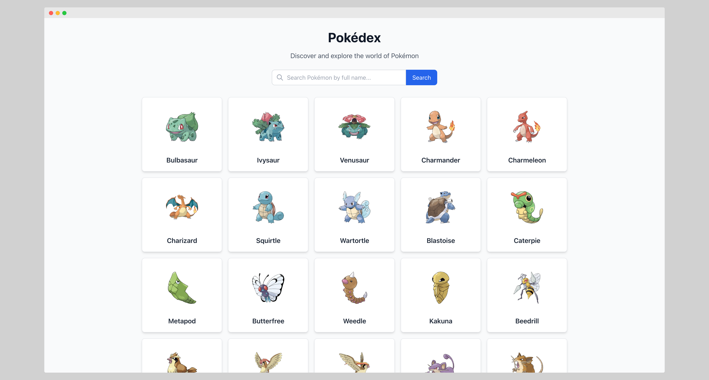

# Mini Pokédex App

A modern, responsive Pokédex application built with React, TypeScript, and Tailwind CSS. The app integrates with the [PokéAPI](https://pokeapi.co/) to provide a comprehensive Pokémon browsing experience with search functionality and detailed information.



## Features

- **Responsive Design** - Works perfectly on desktop, tablet, and mobile devices
- **Exact Name Search** - Search for Pokémon by their exact name with instant results
- **Pagination** - Browse through all Pokémon with smooth pagination (20 per page)
- **Detailed Views** - View comprehensive information about each Pokémon including:
  - Official artwork
  - Base stats with visual progress bars
  - Types, abilities, height, and weight
- **Fast Performance** - Built with Vite for lightning-fast development and builds
- **Accessibility** - Full ARIA support and keyboard navigation
- **Modern UI** - Clean, modern interface with Tailwind CSS styling

## Live Demo

You can try the app here: [https://pokeminihub.vercel.app/](https://pokeminihub.vercel.app/)

## Tech Stack

- **Frontend Framework**: React 19 with TypeScript
- **Build Tool**: Vite
- **Styling**: Tailwind CSS
- **Routing**: React Router v6
- **API**: PokéAPI (REST API)
- **State Management**: Custom React Hooks
- **Code Quality**: ESLint + TypeScript

## Project Structure

```
src/
├── components/
│   ├── atoms/          # Basic UI components (Button, Card, LoadingSpinner)
│   ├── molecules/      # Compound components (SearchBar, Pagination, PokemonCard)
│   └── organisms/      # Complex components (PokemonGrid)
├── hooks/              # Custom React hooks
│   ├── usePokemon.ts   # List, pagination, and search logic
│   └── usePokemonDetail.ts # Single Pokémon details
├── pages/              # Page components
│   ├── PokemonList.tsx # Main Pokémon list page
│   └── PokemonDetail.tsx # Pokémon details page
├── types/              # TypeScript type definitions
├── utils/              # Utility functions
└── App.tsx             # Main application component
```

## How to run?

### Prerequisites

- Node.js (version 16 or higher)
- npm or yarn

### 1. Clone this repository

```bash
git clone https://github.com/KoTubA/mini-pokedex-app.git
```

or with SSH:

```bash
git clone git@github.com:KoTubA/mini-pokedex-app.git
```

### 2. Navigate to the project directory

```bash
cd mini-pokedex-app
```

### 3. Install dependencies

```bash
npm install
```

### 4. Start the development server

```bash
npm run dev
```

Open [http://localhost:5173](http://localhost:5173) to view it in your browser.

The page will reload when you make changes.\
You may also see any lint errors in the console.

## Available Scripts

In the project directory, you can run:

### `npm run dev`

Runs the app in development mode.\
Open [http://localhost:5173](http://localhost:5173) to view it in your browser.

The page will reload when you make changes.\
You may also see any lint errors in the console.

### `npm run build`

Builds the app for production to the `dist` folder.\
It correctly bundles React in production mode and optimizes the build for the best performance.

The build is minified and the filenames include the hashes.\
Your app is ready to be deployed!

### `npm run preview`

Locally preview the production build.

### `npm run lint`

Runs ESLint to check code quality and consistency.

## Acknowledgments

- [PokéAPI](https://pokeapi.co/) for providing the comprehensive Pokémon data
- [Tailwind CSS](https://tailwindcss.com/) for the utility-first CSS framework
- [Vite](https://vitejs.dev/) for the fast build tool
- [React](https://reactjs.org/) for the amazing frontend framework
